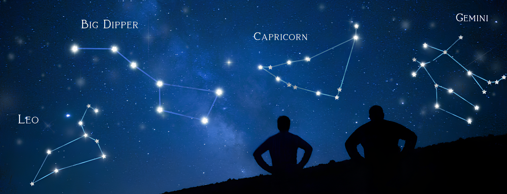

  

  

---

## About

Constellia is a mobile application that identifies the constellations present in
a photograph of the night sky.

## Project tracking

- [Weekly progress reports]([https://drive.google.com/drive/folders/1IVzTJYrK2hULdZw-JGjekjiIKJOGZqGF?usp=drive_link])

## Team

SAÉ 5.Real.01 Développement avancé - BUT Informatique, 3rd year,
University of Lorraine.

**Mikail Tok** · **Hugo Pecoraro** · **Kylian Chylak** · **Gatien Dubot**

Supervisor: Mme Lydia Boudjeloud-Assala

---

*Work in progress - started September 2026.*
